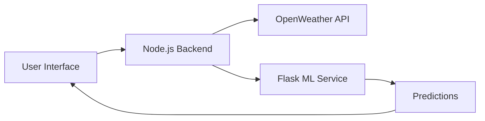

# 🔋 UrbanLoad

<div align="center">


_A Weather-Aware Urban Energy Load Forecasting System_

</div>

## 📝 Overview

UrbanLoad is a sophisticated web application that leverages weather data and machine learning to predict urban electricity demand. Built with sustainability in mind, it empowers users and urban planners with actionable insights aligned with UN SDG #7 (Affordable and Clean Energy).

## ✨ Key Features

- 🤖 **AI-Driven Policy Engine**

  - Converts forecast data into actionable energy insights
  - Optimizes energy distribution strategies

- 📊 **Weather-Aware Load Forecasting**

  - Real-time predictions based on environmental factors
  - Temperature and humidity integration
  - Historical pattern analysis

- 🔐 **Secure Authentication**

  - Role-based access control via Clerk
  - Multi-user support for analysts, admins, and general users

- 🌍 **Sustainability Analytics**

  - Carbon footprint reduction estimates
  - Environmental impact visualization
  - Green energy optimization suggestions

- 📈 **Interactive Dashboard**
  - City-wise load predictions
  - Real-time trend analysis
  - Dynamic power usage visualizations

## 🛠️ Technology Stack

| Layer         | Technologies                                |
| ------------- | ------------------------------------------- |
| ML Model      | Python, Jupyter Notebook                    |
| ML API        | Flask (REST API)                            |
| Backend       | Node.js, OpenWeather API                    |
| Frontend      | React.js, Clerk                             |
| Visualization | Chart.js                                    |
| Hosting       | Vercel (Frontend), Railway/Render (Backend) |

## 🏗️ System Architecture



1. User selects city and date range via React frontend
2. Backend fetches weather forecast from OpenWeatherMap API
3. Flask ML microservice processes data and generates predictions
4. Results displayed through interactive visualizations

## 📁 Project Structure

```
urban-loads/
├── Urbanapp/          # React Frontend
├── Urban_Load/        # Node.js Backend API
├── ML_Service/        # Flask + ML Model
└── README.md
```

## 🚀 Getting Started

### Prerequisites

- Node.js (v14 or higher)
- Python 3.8+
- npm or yarn
- Git

### Installation

1. **Clone the repository**

   ```bash
   git clone https://github.com/pavincletus3/Urban-loads.git
   cd urban-loads
   ```

2. **Install dependencies**

   ```bash
   # Frontend
   cd Urbanapp && npm install

   # Backend
   cd ../Urban_Load && npm install

   # ML Service
   cd ../ML_Service && pip install -r requirements.txt
   ```

3. **Configure environment variables**

   ```bash
   # Backend (.env)
   OPENWEATHER_API_KEY=your_key_here
   ```

4. **Start the services**

   ```bash
   # Frontend
   cd Urbanapp && npm start

   # Backend
   cd ../Urban_Load && npm start

   # ML Service
   cd ../ML_Service && python app.py
   ```

## 📊 Sample Usage

**Input Parameters:**

- City: Mumbai
- Date Range: 2025-04-11 to 2025-04-13
- Weather Conditions: 34°C, 70% humidity

**Output:**

- Predicted load in MW
- CO₂ impact estimates
- Sustainability recommendations

## 🔮 Future Roadmap

- [ ] Real-time smart meter data integration
- [ ] Geo-visual heatmaps with Leaflet.js
- [ ] Enhanced admin analytics dashboard
- [ ] Automated policy recommendations
- [ ] Mobile application development

## 🌱 Impact

UrbanLoad contributes to sustainable urban development by:

- Reducing peak-hour electricity consumption
- Optimizing energy infrastructure usage
- Lowering carbon emissions
- Advancing clean energy goals

## 👥 Team

Made with 💡 by **Team Ctrl+Alt+Defeat (HAE-043)** — Hackera'25 Submission

## 📞 Contact

For queries or contributions, please contact:

- Email: [pavincletus123@gmail.com](mailto:pavincletus123@gmail.com)

## 📄 License

This project is licensed under the MIT License - see the [LICENSE](LICENSE) file for details.

---

<div align="center">
Made with ❤️ for a sustainable future
</div>
